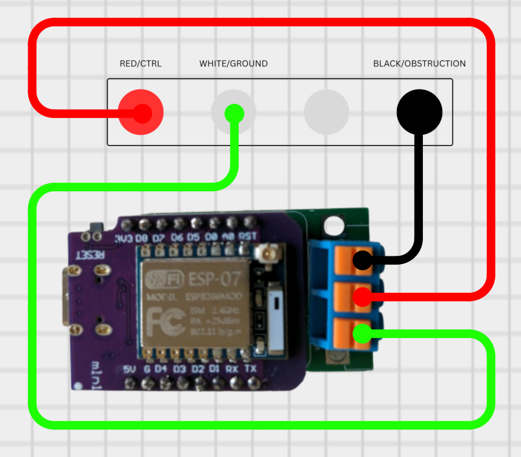

# ratgdo-slim Instruction Manual

ratgdo-slim is an open-source Wi-Fi interface that provides local control and status monitoring of compatible garage door openers through Home Assistant with HomeKit/ESPHome or direct HomeKit integration.

## Disclaimer

This device works with the open-source ratgdo ecosystem. While everything runs great today, Home Assistant and related integrations are community-driven projects, so occasional updates from third-party developers are part of the DIY world.
## Safety Warning

- **Complete all wiring before applying USB power**
- Incorrect wiring may damage the board or garage door opener
- Not intended for safety-critical or security-critical applications
- Ensure garage door opener power is OFF during installation

### Wiring Diagram

<table>
   <tr>
      <td width="25%" align="center" valign="top">
         
      </td>
      <td width="50%" valign="top">
         <strong>Wiring Instructions</strong>
         <ul>
            <li>RED -> Wall control RED</li>
            <li>WHITE -> Ground (GND)</li>
            <li>BLACK -> Obstruction / control line</li>
         </ul>
         <strong>Hardware List</strong>
         <ul>
            <li>ratgdo PCB with ESP-07 (ESP8266)</li>
            <li>USB A to USB C cable</li>
            <li>5V USB power supply</li>
            <li>Garage door opener wall-control wires (RED/WHITE/BLACK)</li>
         </ul>
         
Complete all wiring before applying USB power.

      </td>
   </tr>
</table>

## Unified Section Matrix

<table>
   <thead>
      <tr>
         <th>Section</th>
         <th>ESPHome</th>
         <th>HomeKit</th>
      </tr>
   </thead>
   <tbody>
      <tr>
         <td><strong>Firmware</strong></td>
         <td>
            <ul>
               <li><strong>Best for:</strong> Apple and Android users, especially mixed-device households</li>
               <li><strong>Setup:</strong> Moderate (requires Home Assistant)</li>
               <li><strong>HomeKit path:</strong> Home Assistant HomeKit add-on/bridge for Apple users</li>
               <li><strong>Diagnostics:</strong> Advanced (ESPHome web interface/logs)</li>
               <li><strong>Updates:</strong> OTA supported</li>
               <li><strong>Flashing (if not already flashed):</strong> <a href="https://ratgdo.github.io/esphome-ratgdo/">ESPHome Web Flasher</a></li>
            </ul>
         </td>
         <td>
            <ul>
               <li><strong>Best for:</strong> Direct Apple Home users with simpler setup</li>
               <li><strong>Setup:</strong> Simple (no Home Assistant required)</li>
               <li><strong>HomeKit path:</strong> Direct/native accessory</li>
               <li><strong>Diagnostics:</strong> Basic device web interface</li>
               <li><strong>Updates:</strong> OTA availability is limited</li>
               <li><strong>Flashing (if not already flashed):</strong> <a href="https://ratgdo.github.io/homekit-ratgdo/flash.html">HomeKit Web Flasher</a></li>
            </ul>
         </td>
      </tr>
      <tr>
         <td><strong>What You'll Need</strong></td>
         <td>
            <ul>
               <li>Physical parts: see <strong>Wiring Diagram -> Hardware List</strong></li>
               <li>Home Assistant</li>
               <li>ESPHome add-on or standalone ESPHome</li>
               <li>Apple Home app optional</li>
            </ul>
         </td>
         <td>
            <ul>
               <li>Physical parts: see <strong>Wiring Diagram -> Hardware List</strong></li>
               <li>Apple Home app required</li>
               <li>HomeKit hub required for remote access</li>
               <li>Home Assistant not required</li>
            </ul>
         </td>
      </tr>
      <tr>
         <td><strong>Compatibility</strong></td>
         <td>
            <ul>
               <li>Chamberlain/LiftMaster openers</li>
               <li>Security 1.0 and 2.0 wall-control wiring</li>
               <li>ESP8266 (1MB, 2MB, 4MB)</li>
               <li>Dry contact is supported in the ecosystem, but it is not provided on this board in the current build.</li>
               <li>Home Assistant required</li>
            </ul>
         </td>
         <td>
            <ul>
               <li>Chamberlain/LiftMaster openers</li>
               <li>Security 1.0 and 2.0 wall-control wiring</li>
               <li>ESP8266 (1MB, 2MB, 4MB)</li>
               <li>Dry contact is supported in the ecosystem, but it is not provided on this board in the current build.</li>
               <li>Direct/native Apple HomeKit integration</li>
            </ul>
         </td>
      </tr>
      <tr>
         <td><strong>Installation Guide</strong></td>
         <td>
            <ol>
               <li>Power opener OFF, verify wiring.</li>
               <li>If not already flashed, flash via <a href="https://ratgdo.github.io/esphome-ratgdo/">ESPHome Web Flasher</a>.</li>
               <li>Connect to AP <strong>ratgdo</strong>, open <code>192.168.4.1</code>, configure 2.4GHz Wi-Fi.</li>
               <li>Add device in Home Assistant (Settings > Devices &amp; Services).</li>
               <li>Create HomeKit bridge in Home Assistant and add bridge in Apple Home.</li>
               <li>Test door/light/sensor and assign static IP.</li>
            </ol>
         </td>
         <td>
            <ol>
               <li>Power opener OFF, verify wiring.</li>
               <li>If not already flashed, flash via <a href="https://ratgdo.github.io/homekit-ratgdo/flash.html">HomeKit Web Flasher</a>.</li>
               <li>Connect to AP <strong>Garage-Door-ABCDE</strong> (last 5 MAC chars).</li>
               <li>Open <code>192.168.4.1</code>, configure 2.4GHz Wi-Fi.</li>
               <li>Open device IP to get HomeKit code, then add accessory in Apple Home.</li>
               <li>Test door/light/sensor and assign static IP.</li>
            </ol>
         </td>
      </tr>
      <tr>
         <td><strong>Troubleshooting</strong></td>
         <td>
            <ul>
               <li>Confirm ratgdo and Home Assistant are on same 2.4GHz network.</li>
               <li>Check ESPHome logs and HA device status.</li>
               <li>For pairing issues, remove and re-add HomeKit bridge.</li>
               <li>If door status is wrong, recalibrate open/close travel.</li>
               <li>Power cycle device for 10 seconds.</li>
            </ul>
         </td>
         <td>
            <ul>
               <li>Confirm ratgdo and iPhone/iPad are on same 2.4GHz network.</li>
               <li>Verify HomeKit hub online for remote control.</li>
               <li>If pairing fails, reset and re-add accessory.</li>
               <li>If needed, factory reset (hold reset 10s) and reflash.</li>
               <li>Power cycle device for 10 seconds.</li>
            </ul>
         </td>
      </tr>
   </tbody>
</table>

<small>Open-source hardware · Community supported · User responsible for installation and configuration</small>